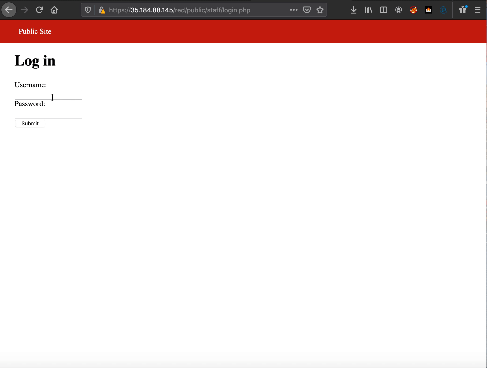

# Project 8 - Pentesting Live Targets

Time spent: **X** hours spent in total

> Objective: Identify vulnerabilities in three different versions of the Globitek website: blue, green, and red.

The six possible exploits are:

* Username Enumeration
* Insecure Direct Object Reference (IDOR)
* SQL Injection (SQLi)
* Cross-Site Scripting (XSS)
* Cross-Site Request Forgery (CSRF)
* Session Hijacking/Fixation

Each color is vulnerable to only 2 of the 6 possible exploits. First discover which color has the specific vulnerability, then write a short description of how to exploit it, and finally demonstrate it using screenshots compiled into a GIF.

## Blue

Vulnerability #1: SQL Injection 

Description: in the blue site you can chang the url and the site wont kick you out. i was in the "salesperson" page and i chaged the url and it didn't sent me back to "find a salesperson". on the other two sites it kicked me out and sent me back to the "find a salesperson" page when i changed the url.

Vulnerability #2: Cross-Site Request Forgery

Description:when you sign in the red site when you go to the blue site you click around and then go to the log in site on the blue site and the blue site will get you in with out logging in. It just gives you access to the site. this is so bad becasue if the hacker has a login to one site he can also get in the blue site and get more infromation and hack two sites.

## Green

Vulnerability #1: Username Enumeration

Description: when you try to log in if the username is in the system but the password is wrong it will say "log in was unsuccessful" in bold but if the usernmae is not in the system it will say "log in was unsuccesful" but it wont be bold. this gives the hacker a better idea which usernames are in the system. 

Vulnerability #2: Cross-Site Scripting

Description: In the green site when you go into the contact menu and put in a fake name and fake email then in the discription you add a code you want to use for a attack. The site does not reconize its an attack and lets the contact menu go through. then you go to feedback and you can see your code went through. this is bad for the site becasue this is basiclly a back door that hackers can get in to and take the inportant information

## Red

Vulnerability #1:Cross-Site Forgery 

Description: in the red site you can change the value through inspect element and the site will not kick you out. this give the hacker to in put an attact with out the user knowing becasue the site will look the same.

Vulnerability #2: Insecure Direct Object Reference 

Description: In the red site with go to one sales man page and you change the url it gives you private information it tells you one guy got fired for stealing and the other guy wont be public until september 1st. when you try to do that in the other sites it just sends you back to the menu it does not let you see the private infromation.

## Notes

Describe any challenges encountered while doing the work

